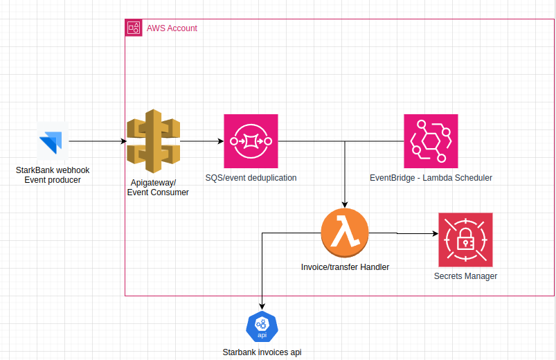

## Setup

### Prerequisites

- AWS CLI configured with appropriate permissions.
- Python 3.8 or higher.
- [`pip`](command:_github.copilot.openSymbolFromReferences?%5B%22pip%22%2C%5B%7B%22uri%22%3A%7B%22%24mid%22%3A1%2C%22fsPath%22%3A%22%2Fhome%2Fhick%2FDownloads%2Fsb-backend-challenge-54e14a70-d16e-41c9-8141-f7fe79afdabb%2Freadme.md%22%2C%22external%22%3A%22file%3A%2F%2F%2Fhome%2Fhick%2FDownloads%2Fsb-backend-challenge-54e14a70-d16e-41c9-8141-f7fe79afdabb%2Freadme.md%22%2C%22path%22%3A%22%2Fhome%2Fhick%2FDownloads%2Fsb-backend-challenge-54e14a70-d16e-41c9-8141-f7fe79afdabb%2Freadme.md%22%2C%22scheme%22%3A%22file%22%7D%2C%22pos%22%3A%7B%22line%22%3A13%2C%22character%22%3A0%7D%7D%5D%5D "Go to definition") for managing Python packages.

### Installation

1. **Clone the repository**:
    ```sh
    git clone https://github.com/HenriqueOs98/sb-backend-challenge
    cd sb-backend-challenge
    ```

2. **Install dependencies**:
    ```sh
    pip install -r requirements.txt
    ```

3. **Configure AWS Secrets Manager**:
    - Store your Stark Bank credentials in AWS Secrets Manager with the secret name [`starkbank_credentials`](command:_github.copilot.openSymbolFromReferences?%5B%22starkbank_credentials%22%2C%5B%7B%22uri%22%3A%7B%22%24mid%22%3A1%2C%22fsPath%22%3A%22%2Fhome%2Fhick%2FDownloads%2Fsb-backend-challenge-54e14a70-d16e-41c9-8141-f7fe79afdabb%2Freadme.md%22%2C%22external%22%3A%22file%3A%2F%2F%2Fhome%2Fhick%2FDownloads%2Fsb-backend-challenge-54e14a70-d16e-41c9-8141-f7fe79afdabb%2Freadme.md%22%2C%22path%22%3A%22%2Fhome%2Fhick%2FDownloads%2Fsb-backend-challenge-54e14a70-d16e-41c9-8141-f7fe79afdabb%2Freadme.md%22%2C%22scheme%22%3A%22file%22%7D%2C%22pos%22%3A%7B%22line%22%3A21%2C%22character%22%3A78%7D%7D%5D%5D "Go to definition").

### Deployment

1. **Deploy the Lambda function**:
    - Package and deploy the Lambda function using AWS SAM or any other deployment tool of your choice.

2. **Configure EventBridge**:
    - Create a rule in EventBridge to trigger the Lambda function every 3 hours.

3. **Set up API Gateway**:
    - Create an API Gateway endpoint to receive invoice callbacks and forward them to the Lambda function.

4. **Configure SQS FIFO Queue**:
    - Create an SQS FIFO Queue to handle event deduplication.


### ARCHITECTURE

